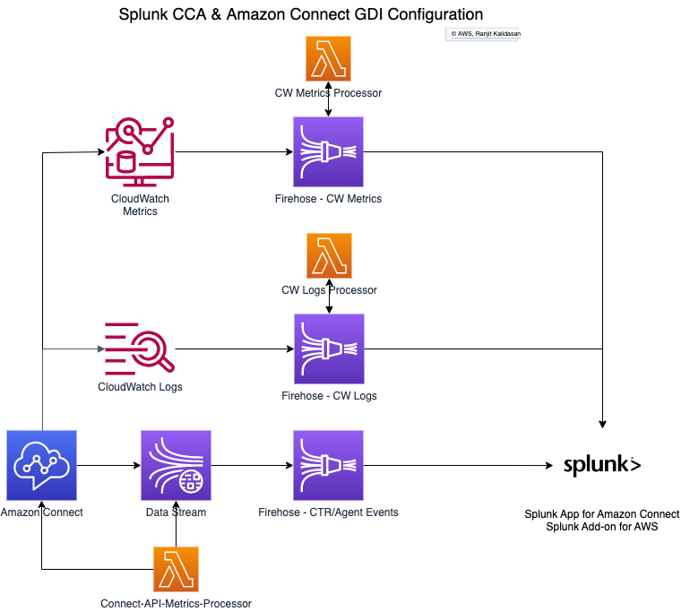

# Splunk CCA Data Sources Deployment for AWS
The Splunk App for Amazon Connect uses a variety of data sources to help gain insight into your contact center performance both historically and in real-time. In standard Splunk fashion, data is democratized so from DevOps and AppDev teams, to Network and Service Operations Centers, to Contact Center Operations, to Engineering and Capacity Management, there’s something in the app for everyone. Key features include:

    1. Call trace record (CTR) correlation
    2. Agent status
    3. Agent performance
    4. Queue statistics
    5. Instance performance
    6. Capacity management visibility
    7. Bidirectional sentiment analysis via Amazon Contact Lens

This Cloudformation Template deploys all the required resouces and configuration to send the above data to Splunk using Firehose and HTTP Event Collector (HEC) token as shown below:

### Cloudformation Input Parameters
The parameters required as input parameters when deploying CloudFormation template are:
 - AmazonConnectInstanceName 
   - Enter name of the Amazon Connect Instance
 - ConnectInstanceId
   - Enter the Amazon Connect Instance Id. You can get this from the ARN of the Amazon Connect Instance.
   - Example: arn:aws:connect:us-east-1:<AWS Account ID>:instance/xxxxxxxx-xxxx-xxxx-xxxx-xxxxxxxxxxxx where xxxxxxxx-xxxx-xxxx-xxxx-xxxxxxxxxxxx is your instance id
 - QSS3BucketName (Default Value: splunk-quick-start)
   - S3 buckets for lambda function code to be copied to local region s3 bucket (do not change the default value)
 - QSS3KeyPrefix (Default Value: SplunkConnectProcessors/)
   - S3 bucket prefix for lambda function code to be copied to local region s3 bucket (do not change the default value)  
 - SplunkHECEndpointUrl
   - Splunk HEC Endpoint URL. Refer to [Splunk Doc](https://docs.splunk.com/Documentation/Splunk/8.2.5/Data/UsetheHTTPEventCollector) if you are using Splunk SaaS Endpoints
 - SplunkHECToken
   - Enter your HEC token. Example: B5A79AAD-D822-46CC-80D1-819F80D7BFB0